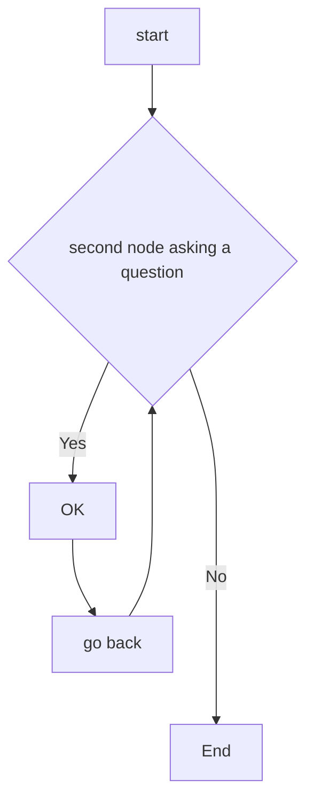

# Decision Support Systems [DSS] in Allied Healthcare
De ontembare groei van elektronische gezondheidsdossiers (EPD) in het laatste decennium heeft een overvloed aan klinische tekst opgeleverd die veelal ongestructureerd is en onbenut blijft.  Een complicerende factor is dat EPDs in Nederlandse ziekenhuizen door slechts een [drietal softwareleveranciers](https://www.zorgvisie.nl/epd-overzicht/) wordt beheerd
. Deze monopolie positie heeft er toe geleid dat de interoperabiliteit van het EPD ---koppelen van  meerdere informatiesystemen--- nogal te wensen over laat volgens de [Nederlandse academische ziekenhuizen](https://www.skipr.nl/nieuws/ziekenhuizen-openen-in-2doc-frontale-aanval-op-chipsoft/).

Desalniettemin, deze enorme hoeveelheid klinische tekstgegevens [---Big data---](https://robfvdw.medium.com/a-generic-approach-to-data-driven-activities-d85ad558b5fa) leent zich voor informatie-extractie en text mining technieken gebaseerd op Kunstmatige Intelligentie (AI) modellen binnen het Natural Language Processing (NLP) toepassingsdomein. 

Speech-to-Text (STT), Named Entity Recognition (NER) en Relationship Extraction (RE) zijn sleutelcomponenten van NLP informatie-extractie taken met betrekking tot het benutten van terminologiestelsels [---ontologieën--- voor de zorg zoals SNOMED](https://nictiz.nl/publicaties/verborgen-kant-van-snomed/).

Voordat deze data-gedreven innovatie mogelijk wordt moet je kunnen beschikken over verzamelingen aan tekst of gesproken taal [CORPORA] die woorden bevatten met betrekking tot het gebruik van taal binnen een specifiek toepassingsdomein (vakgebied) zoals de geassocieerde gezondheidszorg in Nederland [---Klinisch Psychologen, Ergotherapeuten en Fysiotherapeuten---](https://en.wikipedia.org/wiki/Allied_Healthcare).


[Click here to try out Named Entity Recognition [NER] visualizing demo](https://demos.explosion.ai/displacy-ent)

***********
***********

# Project Principles 


- [Do no Harm](https://www.newyorker.com/magazine/2015/05/18/anatomy-of-error)

- Data science is about solving problems [human-in-the-loop], not models or algorithms.

- All validation of data, hypotheses and performance should be tracked and properly peer-reviewed.

- A product needs a definition-of-done to evaluate its quality.

- Research must be broken down into clearly defined tasks. The smallest of iterations should be preferred in acquiring, integrating and correcting knowledge.

- Don’t neglect assumptions in models. Make them explicit then aim to have them either verified or removed.

(Adapted from http://datasciencemanifesto.org/)

***********
***********

# Project AIM

This project aims to create a medical corpus derived from medical case-studies through the use of data enigineering [DE] + data science [DS] techniques and standards such as The CRoss Industry Standard Process for Data Mining [CRISP-DM](https://www.datascience-pm.com/crisp-dm-2/). The endproduct should be in the form of a wel documented digital-protocol that can be readily employed by allied healthcare processionals to perform basic NLP techniques such as Named Entity Recognition (NER) and Relationship Extraction (RE).

That is, utimately making clinical data freely exchangeable between the various professionals within the bachelor IvG and other educational or research institutes of [Rotterdam University of Applied Sciences](https://www.rotterdamuas.com/collaboration/).

The raw data wil be stored on [Research-Drive](https://www.surf.nl/en/research-drive-securely-and-easily-store-and-share-research-data) which is a EU GDPR complient service from SURF.nl. 

***********
***********

# Translational Practice-based Research
This DSS research project focuses on improving allied heathcare. It is a highly transdisciplinary collaboration between 
[IGV](https://www.hogeschoolrotterdam.nl/samenwerking/instituten/instituut-voor-gezondheidszorg/contact/), the [CMI Minor Data Enginering](https://www.hogeschoolrotterdam.nl/samenwerking/samenwerkingsportfolio/minor-big-data-engineering---sustainability/) and the [Prometheus Data-Lab](https://www.hogeschoolrotterdam.nl/onderzoek/lectoren/creating-010/medewerkers/rob-van-der-willigen/).

The project is supported by the [Program for AI & Ethics](https://www.hogeschoolrotterdam.nl/go/ai-en-ethiek/over-ons/#flex), [DCC SURF-pilot project] (https://www.surf.nl/en/news/six-new-pilots-awarded-in-dcc-for-practice-based-research) and [Data Supported Healthcare: Zorgtech010 data-science unit]
(https://www.hogeschoolrotterdam.nl/onderzoek/projecten-en-publicaties/zorginnovatie/zorginnovatie-met-technologie/Data-Supported-Healthcare/).

***********
***********

# NLP OPEN-SOURCE platforms

ToolKit | NLP tasks | Distinctive features  | Neural networks | Best for | Not suitable for                          
--------|-----------|-----------------------|-----------------|----------|-----------------
NLTK    | Classification, tokenization, stemming. tagging. parsing. semantic reasoning | Over 50 corpora Package for chatbots Multilingual support| No | Training, Education, Research | Complex projects with large datasets      
Gensim | Text similarity. text summarization, topic modeling | Scalability and high performance Unsupervised training | No | Converting words and documents into vectors| Supervised text modeling Full NLP pipeline
SpaCy  | Tokenization, CNN tagging, parsing, named entity recognition. classification, sentiment analysis | 50+ languages available for tokenization Easy to learn and use | Yes | Business production |Teaching and research                     
Stanford Core NLP | Tokenization, multi- wordtoken expansion. lemmatization, POS tagging, dependency parsing | Different usage models Multilingual | Yes | Fully functional NLP systems | Beginners                                 
Text Blob| POS tagging.noun phrase extraction sentiment analysis, classification, translation, spelling correction, etc. | Translation and spelling correction | No | NLP prototyping |Largescale productions § altexsoft        


***********
***********

# References

1. NLP reference documentation: https://miro.com/app/board/uXjVOa_6fiQ=/?share_link_id=647822840290

2. https://www.hogeschoolrotterdam.nl/contentassets/e0eaa57e3ee14863911def576f414414/kennisagenda-dsh-final.pdf

3. https://www.hogeschoolrotterdam.nl/contentassets/5bbfcb19052a4bf29b6ac82c988343e4/visie-document-data-ondersteunde-gezondheidszorg-en-innovatie-8-maart-2021-2.pdf

4. https://www.researchgate.net/publication/360808997_Decision_Support_Systems_in_nursing_allied_healthcare_Building_an_AI-based_Learning_Health_System_by_use_op_Natural_Language_Processing_Tools_Dag_van_de_Fysiotherapeut_21_MEI_2022

5. https://www.researchgate.net/publication/360933051_Creating_a_Data_Fabric_through_Easy-to-Use_Cloud_Computing_DCC_SURF-Pilot_3de-ronde_2022_Produced_by_Living-Lab_AiRA_Hub_voor_Data_Responsible_AI_Hogeschool_Rotterdam_httpswwwsurfnlennewssix-new-pilot

6. https://robfvdw.medium.com/a-generic-approach-to-data-driven-activities-d85ad558b5fa

7. https://nictiz.nl/publicaties/snomed-ct-meer-dan-een-terminologiestelsel/

8. https://www.datascience-pm.com/crisp-dm-2/

9. https://www.zorgvisie.nl/content/uploads/sites/2/2018/04/Epd-overzicht2018.pdf

10. https://www.hogeschoolrotterdam.nl/go/ai-en-ethiek/projecten/postdoc-voucher-project-rob-van-der-willigen-designing-neural-networks-through-sensory-ecology/


# CHARTS + CODING




```
function test() {
  console.log("notice the blank line before this function?");
}
```


