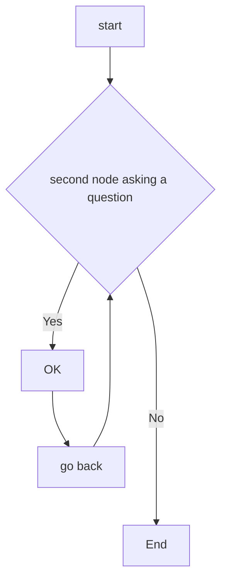

# Decision Support Systems [DSS] in Allied Healthcare
De ontembare groei van elektronische gezondheidsdossiers (EPD) in het laatste decennium heeft een overvloed aan klinische tekst opgeleverd die veelal ongestructureerd is en onbenut blijft.  Een complicerende factor is dat EPDs in Nederlandse ziekenhuizen door slechts een [drietal softwareleveranciers](https://www.zorgvisie.nl/epd-overzicht/) wordt beheerd
. Deze monopolie positie heeft er toe geleid dat de interoperabiliteit van het EPD ---koppelen van  meerdere informatiesystemen--- nogal te wensen over laat volgens de [Nederlandse academische ziekenhuizen](https://www.skipr.nl/nieuws/ziekenhuizen-openen-in-2doc-frontale-aanval-op-chipsoft/).

Desalniettemin, deze enorme hoeveelheid klinische tekstgegevens [---Big data---](https://robfvdw.medium.com/a-generic-approach-to-data-driven-activities-d85ad558b5fa) leent zich voor informatie-extractie en text mining technieken gebaseerd op Kunstmatige Intelligentie (AI) modellen binnen het [Natural Language Processing (NLP)](https://www.ibm.com/cloud/learn/natural-language-processing) toepassingsdomein. 

Speech-to-Text (STT), NGRAM analysis, Named [Entity Recognition (NER)]((https://demos.explosion.ai/displacy-ent)) en Relationship Extraction (RE) zijn sleutelcomponenten van NLP informatie-extractie taken met betrekking tot het benutten van terminologiestelsels [---ontologieën---](https://nl.wikipedia.org/wiki/Ontologie_(informatica)) voor de zorg zoals [SNOMED](https://nictiz.nl/publicaties/verborgen-kant-van-snomed/).

Voordat deze data-gedreven innovatie mogelijk wordt moet je kunnen beschikken over verzamelingen aan tekst of gesproken taal [CORPORA](https://ivdnt.org/corpora-lexica/#:~:text=Een%20corpus%20is%20een%20grote,en%20voor%20allerlei%20wetenschappelijk%20onderzoek.) die woorden bevatten met betrekking tot het gebruik van taal binnen een specifiek toepassingsdomein (vakgebied) zoals de geassocieerde gezondheidszorg in Nederland [---Klinisch Psychologen, Ergotherapeuten en Fysiotherapeuten---](https://en.wikipedia.org/wiki/Allied_Healthcare).

***********
***********

# NLP OPEN-SOURCE Python Tools

[Natural Language Processing (NLP)](https://www.ibm.com/cloud/learn/natural-language-processing) is a AI-discipline that leverages linguistics and computer science to make human language intelligible to machines. By allowing computers to automatically analyze massive sets of data, NLP can help you find meaningful information in just seconds.

To harnass NLP capabilities, there are high quality open-source NLP tools available allowing developers to discover valuable insights from unstructured texts.
That is, dealing with text analysis problems like classification, word ambiguity, sentiment analysis etc.

Below an inventory is given on state-of-the-art  ---[Python programming language based](https://www.python.org/)--- open-source natural-language processing (NLP) tools & software. These are suites of libraries, frameworks, and applications for symbolic, statistical natural-language and speech processing.

Tool | NLP tasks | Distinctive features  | Neural networks | Best for | Not suitable for                          
--------|-----------|-----------------------|-----------------|----------|-----------------
NLTK    | Classification, tokenization, stemming. tagging. parsing. semantic reasoning | Over 50 corpora Package for chatbots Multilingual support| No | Training, Education, Research | Complex projects with large datasets      
Gensim | Text similarity. text summarization, SOTA topic modeling | Scalability and high performance Unsupervised training | No | Converting words and documents into vectors| Supervised text modeling Full NLP pipeline
SpaCy  | Tokenization, CNN tagging, parsing, named entity recognition. classification, sentiment analysis | 50+ languages (Dutch) available for tokenization Easy to learn and use | Yes |Teaching and research | Business production    
Textacy | Tokenization, Part-of-Speech Tagging, Dependency Parsing | High-performance SpaCy library | No | Access and extend spaCy’s core functionality | Beginners
Stanford CoreNLP Python Interface | Tokenization, multi- wordtoken expansion. lemmatization, POS tagging, dependency parsing | Different usage models Multilingual | Yes | Fully functional NLP systems | Beginners                                 
Text Blob| POS tagging.noun phrase extraction sentiment analysis, classification, translation, spelling correction, etc. | Translation and spelling correction | No | NLP prototyping | Largescale productions § altexsoft       
PyTorch-NLP | Word2Vector Encoding, Dataset Sampling | Neural Network pre-trained Embeddings | Yes | Rapid Prototyping, Research | Beginners
AllenNLP | high-level configuration language to implement many common approaches in NLP, such as transformer experiments, multi-task training, vision+language tasks, fairness, and interpretability | Solving natural language processing tasks in PyTorch |  Yes | Experimentation | Developement has stopped
FlairNLP | Get insight from text extraction, word embedding, named entity recognition, parts of speech tagging, and text classification | Sense Disambiguation + Classification, Sentiment Analysis | No  | Supports Biomedical Datasets | Business production
Spark-NLP |  NLP-library for use with Apache Spark | Easy to scale by extending Apache Spark natively | Yes | Use of SOTA transformers such as BERT & ELMO at scale by extending Apache Spark natively | Beginners


***********
***********


# NGRAM Code example 

```
from nltk import ngrams
sentence = input("Enter the sentence: ")
n = int(input("Enter the value of n: "))
n_grams = ngrams(sentence.split(), n)
for grams in n_grams:
    print(grams)
```

[](https://mybinder.org/v2/gh/robvdw/Decision-Support-Systems-In-Allied-Healthcare/196a8b897c8f912d7417c0063616495e3bbd77aa?urlpath=lab%2Ftree%2FNotebooks%2FNGRAM-NLTK_V01.ipynb)

***********
***********

# Domain-specific (clinical) Language models in Dutch

A major difficulty to allow for NLP of dutch clinical narratives/free-texts is the lack of AI-models. A wide range of AI-models are solely available
in English. The [Huggingface Transformer framework](https://aclanthology.org/2020.emnlp-demos.6/) offers
a multitude of English Transformer models and variations of Bidirectional Encoder Representations
which includes the [Transformer BERT](https://arxiv.org/abs/1810.04805). 
Notably, the Huggingface-Hub comprises the [Flair framework](https://aclanthology.org/N19-4010/) 
which offers Dutch biomedical support by means of the ["BERTje transformer model"](https://arxiv.org/abs/1912.09582). 

In conclussion, automated encoding of free-text clinical narratives/free-texts using concepts from
NLP is widely performed. However, the majority of open-source NLP tools --- e.g. [SpaCY](https://spacy.io/)--- and terminological systems --- e.g. [SNOMED](https://confluence.ihtsdotools.org/)--- involved are written in the English
language. See for example: [Cornet et al. (2012)](https://doi.org/10.3233/978-1-61499-101-4-245). Inventory of tools for Dutch clinical language processing. In Studies in Health Technology and Informatics (pp. 245-249).

***********
***********

# Project Principles 

Discover Research Phase | Define Synthesis Phase | Develop Ideation Phase | Deliver Implementation Phase                                                                                                                        
------------------------|------------------------|------------------------|------------------------------
\[0\] Collection        |\[2\] Preparation + Wrangling (Munging)   |\[3\] Exploration     |\[6\] Organization + Managing                                                                                                                       
\[1\] Access + Retrieval                                                                                                              |                                                                            |\[4\] Analysis + Machine-Learning \[5\] Abstraction                                                                                                                                                                |\[7\] Automation + Reporting                                                                                                                        
Big Data (Acuisition/Aggregation) Gathering Empirical (Sensor/IoT Measuring/Sampling) Ownership (Open/Closed) Storage (Cloud/Database)|Loading Feature Extraction/Reduction Normalization Transformation Conversion|Graphical (spatial) Ontological (Language) Semantic (text) Rule-based/Algorithmic Quantitative/Qualitative Numerical/Categorical/Symbolic                                                                          |Visualization Virtualization Performance (Measure/Monitor) Evaluation & Review Decision & Advise or Prescription (Interactive/Passive) Story Telling


- [Do no Harm](https://www.newyorker.com/magazine/2015/05/18/anatomy-of-error)

- Data science is about solving problems [human-in-the-loop], not models or algorithms.

- All validation of data, hypotheses and performance should be tracked and properly peer-reviewed.

- A product needs a definition-of-done to evaluate its quality.

- Research must be broken down into clearly defined tasks. The smallest of iterations should be preferred in acquiring, integrating and correcting knowledge.

- Don’t neglect assumptions in models. Make them explicit then aim to have them either verified or removed.

(Adapted from http://datasciencemanifesto.org/)

***********
***********

# Project AIM

This project aims to create a medical corpus derived from medical case-studies through the use of data enigineering [DE] + data science [DS] techniques and standards such as The CRoss Industry Standard Process for Data Mining [CRISP-DM](https://www.datascience-pm.com/crisp-dm-2/). The endproduct should be in the form of a wel documented digital-protocol that can be readily employed by allied healthcare processionals to perform basic NLP techniques such as Named Entity Recognition (NER) and Relationship Extraction (RE).

That is, utimately making clinical data freely exchangeable between the various professionals within the bachelor IvG and other educational or research institutes of [Rotterdam University of Applied Sciences](https://www.rotterdamuas.com/collaboration/).

The raw data wil be stored on [Research-Drive](https://www.surf.nl/en/research-drive-securely-and-easily-store-and-share-research-data) which is a EU GDPR complient service from SURF.nl. 

***********
***********

# Translational Practice-based Research
This DSS research project focuses on improving allied heathcare. It is a highly transdisciplinary collaboration between 
[IGV](https://www.hogeschoolrotterdam.nl/samenwerking/instituten/instituut-voor-gezondheidszorg/contact/), the [CMI Minor Data Enginering](https://www.hogeschoolrotterdam.nl/samenwerking/samenwerkingsportfolio/minor-big-data-engineering---sustainability/) and the [Prometheus Data-Lab](https://www.hogeschoolrotterdam.nl/onderzoek/lectoren/creating-010/medewerkers/rob-van-der-willigen/). Supported is geven by the [Program for AI & Ethics](https://www.hogeschoolrotterdam.nl/go/ai-en-ethiek/over-ons/#flex), [DCC SURF-pilot project](https://www.surf.nl/en/news/six-new-pilots-awarded-in-dcc-for-practice-based-research) and [Data Supported Healthcare: Zorgtech010 data-science unit](https://www.hogeschoolrotterdam.nl/onderzoek/projecten-en-publicaties/zorginnovatie/zorginnovatie-met-technologie/Data-Supported-Healthcare/).

***********
***********

# References

1. NLP reference documentation: https://miro.com/app/board/uXjVOa_6fiQ=/?share_link_id=647822840290

2. https://www.hogeschoolrotterdam.nl/contentassets/e0eaa57e3ee14863911def576f414414/kennisagenda-dsh-final.pdf

3. https://www.hogeschoolrotterdam.nl/contentassets/5bbfcb19052a4bf29b6ac82c988343e4/visie-document-data-ondersteunde-gezondheidszorg-en-innovatie-8-maart-2021-2.pdf

4. https://www.researchgate.net/publication/360808997_Decision_Support_Systems_in_nursing_allied_healthcare_Building_an_AI-based_Learning_Health_System_by_use_op_Natural_Language_Processing_Tools_Dag_van_de_Fysiotherapeut_21_MEI_2022

5. https://www.researchgate.net/publication/360933051_Creating_a_Data_Fabric_through_Easy-to-Use_Cloud_Computing_DCC_SURF-Pilot_3de-ronde_2022_Produced_by_Living-Lab_AiRA_Hub_voor_Data_Responsible_AI_Hogeschool_Rotterdam_httpswwwsurfnlennewssix-new-pilot

6. https://robfvdw.medium.com/a-generic-approach-to-data-driven-activities-d85ad558b5fa

7. https://nictiz.nl/publicaties/snomed-ct-meer-dan-een-terminologiestelsel/

8. https://www.datascience-pm.com/crisp-dm-2/

9. https://www.zorgvisie.nl/content/uploads/sites/2/2018/04/Epd-overzicht2018.pdf

10. https://www.hogeschoolrotterdam.nl/go/ai-en-ethiek/projecten/postdoc-voucher-project-rob-van-der-willigen-designing-neural-networks-through-sensory-ecology/

11. [Inventory of Tools for Dutch Clinical Language Processing, 2012](https://doi.org/10.3233/978-1-61499-101-4-245)


# CHARTS + CODING




```
function test() {
  console.log("notice the blank line before this function?");
}
```


