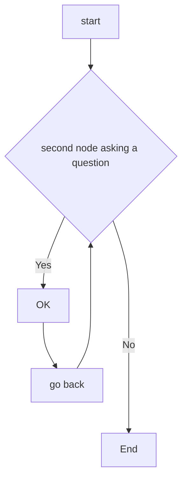

# Decision Support Systems [DSS] in Allied Healthcare
De ontembare groei van elektronische gezondheidsdossiers (EPD) in het laatste decennium heeft een overvloed aan klinische tekst opgeleverd die veelal ongestructureerd is en onbenut blijft.  Een complicerende factor is dat EPDs in Nederlandse ziekenhuizen door slechts een [drietal softwareleveranciers](https://www.zorgvisie.nl/epd-overzicht/) wordt beheerd
. Deze monopolie positie heeft er toe geleid dat de interoperabiliteit van het EPD ---koppelen van  meerdere informatiesystemen--- nogal te wensen over laat volgens de [Nederlandse academische ziekenhuizen](https://www.skipr.nl/nieuws/ziekenhuizen-openen-in-2doc-frontale-aanval-op-chipsoft/).

Desalniettemin, deze enorme hoeveelheid klinische tekstgegevens [---Big data---](https://robfvdw.medium.com/a-generic-approach-to-data-driven-activities-d85ad558b5fa) leent zich voor informatie-extractie en text mining technieken gebaseerd op Kunstmatige Intelligentie (AI) modellen binnen het [Natural Language Processing (NLP)](https://www.ibm.com/cloud/learn/natural-language-processing) toepassingsdomein. 

Speech-to-Text [(STT)](https://azure.microsoft.com/nl-nl/products/cognitive-services/speech-to-text/#overview), [NGRAM](https://mybinder.org/v2/gh/robvdw/Decision-Support-Systems-In-Allied-Healthcare/196a8b897c8f912d7417c0063616495e3bbd77aa?urlpath=lab%2Ftree%2FNotebooks%2FNGRAM-NLTK_V01.ipynb) analysis, Named [Entity Recognition (NER)](https://demos.explosion.ai/displacy-ent?text=e%20ontembare%20groei%20van%20elektronische%20gezondheidsdossiers%20(EPD)%20in%20het%20laatste%20decennium%20heeft%20een%20overvloed%20aan%20klinische%20tekst%20opgeleverd%20die%20veelal%20ongestructureerd%20is%20en%20onbenut%20blijft.%20Een%20complicerende%20factor%20is%20dat%20EPDs%20in%20Nederlandse%20ziekenhuizen%20door%20slechts%20een%20drietal%20softwareleveranciers%20wordt%20beheerd%20.%20Deze%20monopolie%20positie%20heeft%20er%20toe%20geleid%20dat%20de%20interoperabiliteit%20van%20het%20EPD%20---koppelen%20van%20meerdere%20informatiesystemen---%20nogal%20te%20wensen%20over%20laat%20volgens%20de%20100%20%0ANederlandse%20academische%20ziekenhuizen.%0A&model=nl_core_news_sm&ents=person%2Corg%2Cgpe%2Cloc%2Cproduct%2Cnorp%2Cdate%2Cper%2Cmisc%2Clanguage%2Cevent%2Ctime%2Cmoney%2Ccardinal%2Cordinal%2Cquantity%2Cpercent%2Cwork_of_art) en Relationship Extraction (RE) zijn sleutelcomponenten van NLP informatie-extractie taken met betrekking tot het benutten van terminologiestelsels [---ontologieën---](https://nl.wikipedia.org/wiki/Ontologie_(informatica)) voor de zorg zoals [SNOMED](https://nictiz.nl/publicaties/verborgen-kant-van-snomed/).

Voordat deze data-gedreven innovatie mogelijk wordt moet je kunnen beschikken over verzamelingen aan tekst of gesproken taal [CORPORA](https://ivdnt.org/corpora-lexica/#:~:text=Een%20corpus%20is%20een%20grote,en%20voor%20allerlei%20wetenschappelijk%20onderzoek.) die woorden bevatten met betrekking tot het gebruik van taal binnen een specifiek toepassingsdomein (vakgebied) zoals de geassocieerde gezondheidszorg in Nederland [---Klinisch Psychologen, Ergotherapeuten en Fysiotherapeuten---](https://en.wikipedia.org/wiki/Allied_Healthcare).

***********
***********

# What is NLP?

[Natural Language Processing (NLP)](https://www.ibm.com/cloud/learn/natural-language-processing) is a hybrid AI-discipline that is developed from [linguistics](https://en.wikipedia.org/wiki/Linguistics) and [computer science](https://en.wikipedia.org/wiki/Computer_science) to make human language intelligible to machines. 
The computers’ availability in the 1960s gave rise to NLP applications on computers known as [computational linguistics](https://en.wikipedia.org/wiki/Computational_linguistics). It uses syntactic ---[parsing](https://en.wikipedia.org/wiki/Parsing)--- and semantic ---[semiotics](https://en.wikipedia.org/wiki/Semiotics)--- analysis of text and speech to determine the meaning of a sentence. Syntax refers to the grammatical structure of a sentence, while semantics alludes to its intended meaning. By allowing computers to automatically analyze massive sets of data, NLP can find meaningful information in just milliseconds. NLP covers two major ---intersecting--- problem-domains [NLU + NLG](https://www.ibm.com/blogs/watson/2020/11/nlp-vs-nlu-vs-nlg-the-differences-between-three-natural-language-processing-concepts/).


The structure of language is hierarchical comprising of six levels:

[1] Phonology, [2] Morphology, [3] Lexical, [4] Syntax, [5] Semantics and [6] Pragmatics

Phonology refers to the elementary sounds. Morphology refers to elementary combinations of letters and sounds. Lexical level refers to individual words formed of Morphemes. Syntax refers to combination of words. Semantics refers to the rules used to convey meaning using the lower levels. Pragmatics refers to behavioral constraints on the use of language. Discourse can be considered to be the next level, as most linguistic interchanges comprise of more than one sentence.

<div align="center">
    
Language Structure |               |  NLP Application
------- | ------ | -------------
Phonemes [speech & sounds] |  ⇌⇌⇌⇌⇌⇌⇌⇌⇌⇌⇌   | Speech tot Text / Speaker identification / Text to Speech
Morphenes & Lexemes [words] |  ⇌⇌⇌⇌⇌⇌⇌⇌⇌⇌⇌   | Tokenization / Word Embeddings / PoS Tagging
Syntax [phrases & sentences] |  ⇌⇌⇌⇌⇌⇌⇌⇌⇌⇌⇌   | Parsing / Entity Extraction / Relation Extraction
context  [meaning] |   ⇌⇌⇌⇌⇌⇌⇌⇌⇌⇌⇌   | Summarization / Topic modeling  / Sentiment Analysis
    
</div>    
    

Natural Language Understanding [(NLU)](https://en.wikipedia.org/wiki/Natural-language_understanding): It is considerd a "Hard AI-problem". The ambiguity and creativity of human language are just two of the characteristics that make NLP a demanding area to work in. The goal is to resolve ambiguities, obtain context and understand the meaning of what's being said. In particular, it tackles the complexities of language beyond the basic sentence structure. NLU is commonly used in [text mining](https://en.wikipedia.org/wiki/Text_mining) to understand consumer attitudes. In particular, sentiment analysis enables brands to monitor their customer feedback more closely, allowing them to cluster positive and negative social media comments and track net promoter scores. NLU can also establish a relevant [ontology](https://en.wikipedia.org/wiki/Ontology_(information_science)): a data structure which specifies the relationships between words and phrases. While humans naturally do this in [conversation](https://en.wikipedia.org/wiki/Discourse_analysis), the combination of these analyses is required for a machine to understand the intended meaning of different texts.


Natural Language Generation [(NLG)](https://en.wikipedia.org/wiki/Natural_language_generation): While NLU focuses on computers to comprehend human language, NLG enables computers to write. Initially, NLG systems used templates to generate text. Based on some data or query, an NLG system would fill in the blank, like a game of Mad Libs. But over time, natural language generation systems have evolved with the application of hidden Markov chains, recurrent neural networks, and transformers, enabling more dynamic text generation in real time. Given an internal representation, this involves selecting the right words, forming phrases and sentences. Sentences need to ordered so that information is conveyed correctly. It produces a human language text response based on some data input. This text can also be converted into a speech format through text-to-speech services.

In summary, NLU is about both analysis and synthesis.  Sentiment analysis and semantic search are examples of NLU. Captioning an image or video is mainly an NLG task since this type of input is not "textual". Text summarization and chatbot are applications that involve both NLU and NLG. NLG also encompasses text summarization capabilities that generate summaries from input documents while maintaining the integrity of the information. 


## NGRAM Code example 

```
from nltk import ngrams
sentence = input("Enter the sentence: ")
n = int(input("Enter the value of n: "))
n_grams = ngrams(sentence.split(), n)
for grams in n_grams:
    print(grams)
```

[](https://mybinder.org/v2/gh/robvdw/Decision-Support-Systems-In-Allied-Healthcare/196a8b897c8f912d7417c0063616495e3bbd77aa?urlpath=lab%2Ftree%2FNotebooks%2FNGRAM-NLTK_V01.ipynb)

***********
***********

# NLP OPEN-SOURCE Python Tools

To harnass NLP capabilities, there are high quality open-source NLP tools available allowing developers to discover valuable insights from unstructured texts.
That is, dealing with text analysis problems like classification, word ambiguity, sentiment analysis etc.

The here shown inventory is given on state-of-the-art  ---[Python programming language based](https://www.python.org/)--- open-source natural-language processing (NLP) tools & software. These are suites of libraries, frameworks, and applications for symbolic, statistical natural-language and speech processing.


Tool | NLP tasks | Distinctive features  | Neural networks | Best for | Not suitable for                          
--------|-----------|-----------------------|-----------------|----------|-----------------
NLTK    | Classification, tokenization, stemming. tagging. parsing. semantic reasoning | Over 50 corpora Package for chatbots Multilingual support| No | Training, Education, Research | Complex projects with large datasets      
Gensim | Text similarity. text summarization, SOTA topic modeling | Scalability and high performance Unsupervised training | No | Converting words and documents into vectors| Supervised text modeling Full NLP pipeline
SpaCy  | Tokenization, CNN tagging, parsing, named entity recognition. classification, sentiment analysis | 50+ languages (Dutch) available for tokenization Easy to learn and use | Yes |Teaching and research | Business production    
Textacy | Tokenization, Part-of-Speech Tagging, Dependency Parsing | High-performance SpaCy library | No | Access and extend spaCy’s core functionality | Beginners
Stanford CoreNLP Python Interface | Tokenization, multi- wordtoken expansion. lemmatization, POS tagging, dependency parsing | Different usage models Multilingual | Yes | Fully functional NLP systems, Coreference resolution | Beginners                                 
Text Blob| POS tagging.noun phrase extraction sentiment analysis, classification, translation, spelling correction, etc. | Translation and spelling correction | No | NLP prototyping | Largescale productions § altexsoft       
PyTorch-NLP | Word2Vector Encoding, Dataset Sampling | Neural Network pre-trained Embeddings | Yes | Rapid Prototyping, Research | Beginners
AllenNLP | high-level configuration language to implement many common approaches in NLP, such as transformer experiments, multi-task training, vision+language tasks, fairness, and interpretability | Solving natural language processing tasks in PyTorch |  Yes | Experimentation | Developement has stopped
FlairNLP | Get insight from text extraction, word embedding, named entity recognition, parts of speech tagging, and text classification | Sense Disambiguation + Classification, Sentiment Analysis | No  | Supports Biomedical Datasets | Business production
Spark-NLP |  NLP-library for use with Apache Spark | Easy to scale by extending Apache Spark natively | Yes | Use of SOTA transformers such as BERT & ELMO at scale by extending Apache Spark natively | Beginners


***********
***********

# Domain-specific (clinical) Language models in Dutch

A major difficulty to allow for NLP of dutch clinical narratives/free-texts is the lack of AI-models. A wide range of AI-models are solely available
in English. The [Huggingface Transformer framework](https://aclanthology.org/2020.emnlp-demos.6/) offers
a multitude of English [Transformer models](https://jalammar.github.io/illustrated-transformer/) and variations of Bidirectional Encoder Representations
which includes the [Transformer BERT](https://arxiv.org/abs/1810.04805). 
Notably, the Huggingface-Hub comprises the [Flair framework](https://aclanthology.org/N19-4010/) 
which offers Dutch biomedical support by means of the ["BERTje transformer model"](https://arxiv.org/abs/1912.09582). 

In conclusion, automated encoding of free-text clinical narratives/free-texts using concepts from
NLP is widely performed. However, the majority of open-source NLP tools --- e.g. [SpaCY](https://spacy.io/)--- and terminological systems --- e.g. [SNOMED](https://confluence.ihtsdotools.org/)--- involved are written in the English
language [Cornet et al. (2012)](https://doi.org/10.3233/978-1-61499-101-4-245).

***********
***********

# Project Principles 

Discover Research Phase | Define Synthesis Phase | Develop Ideation Phase | Deliver Implementation Phase                                                                                                                        
------------------------|------------------------|------------------------|------------------------------
\[0\] Collection        |\[2\] Preparation + Wrangling (Munging)   |\[3\] Exploration     |\[6\] Organization + Managing                                                                                                                       
\[1\] Access + Retrieval                                                                                                              |                                                                            |\[4\] Analysis + Machine-Learning \[5\] Abstraction                                                                                                                                                                |\[7\] Automation + Reporting                                                                                                                        
Big Data (Acuisition/Aggregation) Gathering Empirical (Sensor/IoT Measuring/Sampling) Ownership (Open/Closed) Storage (Cloud/Database)|Loading Feature Extraction/Reduction Normalization Transformation Conversion|Graphical (spatial) Ontological (Language) Semantic (text) Rule-based/Algorithmic Quantitative/Qualitative Numerical/Categorical/Symbolic                                                                          |Visualization Virtualization Performance (Measure/Monitor) Evaluation & Review Decision & Advise or Prescription (Interactive/Passive) Story Telling


- [Do no Harm](https://www.newyorker.com/magazine/2015/05/18/anatomy-of-error)

- Data science is about solving problems [human-in-the-loop], not models or algorithms.

- All validation of data, hypotheses and performance should be tracked and properly peer-reviewed.

- A product needs a definition-of-done to evaluate its quality.

- Research must be broken down into clearly defined tasks. The smallest of iterations should be preferred in acquiring, integrating and correcting knowledge.

- Don’t neglect assumptions in models. Make them explicit then aim to have them either verified or removed.

(Adapted from http://datasciencemanifesto.org/)

***********
***********

# Project AIM

This project aims to create a medical corpus derived from medical case-studies through the use of data enigineering [DE] + data science [DS] techniques and standards such as The CRoss Industry Standard Process for Data Mining [CRISP-DM](https://www.datascience-pm.com/crisp-dm-2/). The endproduct should be in the form of a wel documented digital-protocol that can be readily employed by allied healthcare processionals to perform basic NLP techniques such as Named Entity Recognition (NER) and Relationship Extraction (RE).

That is, utimately making clinical data freely exchangeable between the various professionals within the bachelor IvG and other educational or research institutes of [Rotterdam University of Applied Sciences](https://www.rotterdamuas.com/collaboration/).

The raw data wil be stored on [Research-Drive](https://www.surf.nl/en/research-drive-securely-and-easily-store-and-share-research-data) which is a EU GDPR complient service from SURF.nl. 

***********
***********

# Translational Practice-based Research
This DSS research project focuses on improving allied heathcare. It is a highly transdisciplinary collaboration between 
[IGV](https://www.hogeschoolrotterdam.nl/samenwerking/instituten/instituut-voor-gezondheidszorg/contact/), the [CMI Minor Data Enginering](https://www.hogeschoolrotterdam.nl/samenwerking/samenwerkingsportfolio/minor-big-data-engineering---sustainability/) and the [Prometheus Data-Lab](https://www.hogeschoolrotterdam.nl/onderzoek/lectoren/creating-010/medewerkers/rob-van-der-willigen/). Supported is geven by the [Program for AI & Ethics](https://www.hogeschoolrotterdam.nl/go/ai-en-ethiek/over-ons/#flex), [DCC SURF-pilot project](https://www.surf.nl/en/news/six-new-pilots-awarded-in-dcc-for-practice-based-research) and [Data Supported Healthcare: Zorgtech010 data-science unit](https://www.hogeschoolrotterdam.nl/onderzoek/projecten-en-publicaties/zorginnovatie/zorginnovatie-met-technologie/Data-Supported-Healthcare/).

***********
***********

# References

1. NLP reference documentation: https://miro.com/app/board/uXjVOa_6fiQ=/?share_link_id=647822840290

2. https://www.hogeschoolrotterdam.nl/contentassets/e0eaa57e3ee14863911def576f414414/kennisagenda-dsh-final.pdf

3. https://www.hogeschoolrotterdam.nl/contentassets/5bbfcb19052a4bf29b6ac82c988343e4/visie-document-data-ondersteunde-gezondheidszorg-en-innovatie-8-maart-2021-2.pdf

4. https://www.researchgate.net/publication/360808997_Decision_Support_Systems_in_nursing_allied_healthcare_Building_an_AI-based_Learning_Health_System_by_use_op_Natural_Language_Processing_Tools_Dag_van_de_Fysiotherapeut_21_MEI_2022

5. https://www.researchgate.net/publication/360933051_Creating_a_Data_Fabric_through_Easy-to-Use_Cloud_Computing_DCC_SURF-Pilot_3de-ronde_2022_Produced_by_Living-Lab_AiRA_Hub_voor_Data_Responsible_AI_Hogeschool_Rotterdam_httpswwwsurfnlennewssix-new-pilot

6. https://robfvdw.medium.com/a-generic-approach-to-data-driven-activities-d85ad558b5fa

7. https://nictiz.nl/publicaties/snomed-ct-meer-dan-een-terminologiestelsel/

8. https://www.datascience-pm.com/crisp-dm-2/

9. https://www.zorgvisie.nl/content/uploads/sites/2/2018/04/Epd-overzicht2018.pdf

10. https://www.hogeschoolrotterdam.nl/go/ai-en-ethiek/projecten/postdoc-voucher-project-rob-van-der-willigen-designing-neural-networks-through-sensory-ecology/

11. [Inventory of Tools for Dutch Clinical Language Processing, 2012](https://doi.org/10.3233/978-1-61499-101-4-245)


# CHARTS + CODING




```
function test() {
  console.log("notice the blank line before this function?");
}
```


