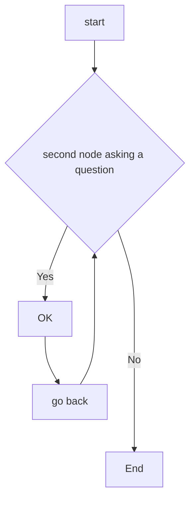

Blocks of Language |               |  Applications
------- | ------ | -------------
context  [meaning] |   ⇌⇌⇌⇌⇌⇌⇌⇌⇌⇌⇌   | Summarization / Topic modeling  / Sentiment Analysis
Syntax [phrases & sentences] |  ⇌⇌⇌⇌⇌⇌⇌⇌⇌⇌⇌   | Parsing / Entity Extraction / Relation Extraction
Morphenes & Lexemes [word] |  ⇌⇌⇌⇌⇌⇌⇌⇌⇌⇌⇌   | PTokenization / Word Embeddings / PoS Tagging


# CHARTS + CODING




```
function test() {
  console.log("notice the blank line before this function?");
}
```


