# MARK DOWN DIAGRAMS

https://python.astrotech.io/design-patterns/uml/mermaid.html

https://mermaid-js.github.io/mermaid/#/theming

https://github.com/mermaidjs/mermaid-live-editor

https://support.typora.io/Draw-Diagrams-With-Markdown/

https://ckeditor.com/blog/basic-overview-of-creating-flowcharts-using-mermaid/

https://mermaid-js.github.io/mermaid-live-editor/edit#pako:eNpVj80OgkAMhF-l6UkTeQEOJgLKxUQTvbEcGqjsRvcnyxJjgHd30Yv21HS-mUxHbGzLmGLnyUm4FsJAnF2VS6_6oKmvIUm2U8kBtDX8miBblRZ6aZ1Tplt_-WyBIB-PC8YQpDL3-SvlH__J8ARFdSQXrKt_levTTrCv1FnG-H9Feo6uQ3Wj9EZJQx5y8h8EN6jZa1JtrD4uF4FBsmaBaVxb8neBwsyRoyHYy8s0mAY_8AYH11LgQlH8WGMMfvQ8vwGEfFP7

# 

Blocks of Language |               |  Applications
------- | ------ | -------------
context  [meaning] |   ⇌⇌⇌⇌⇌⇌⇌⇌⇌⇌⇌   | Summarization / Topic modeling  / Sentiment Analysis
Syntax [phrases & sentences] |  ⇌⇌⇌⇌⇌⇌⇌⇌⇌⇌⇌   | Parsing / Entity Extraction / Relation Extraction
Morphenes & Lexemes [word] |  ⇌⇌⇌⇌⇌⇌⇌⇌⇌⇌⇌   | PTokenization / Word Embeddings / PoS Tagging

#

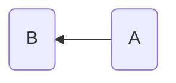

#

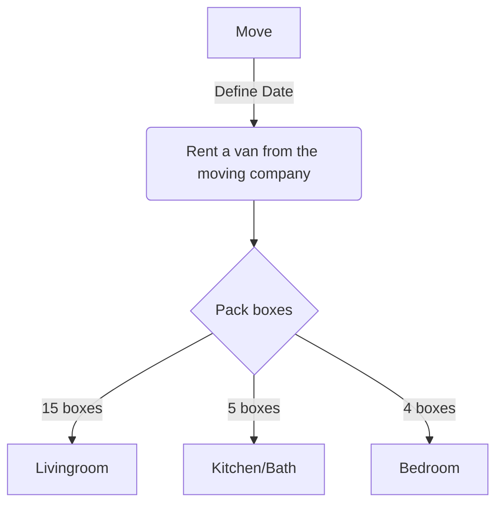
#

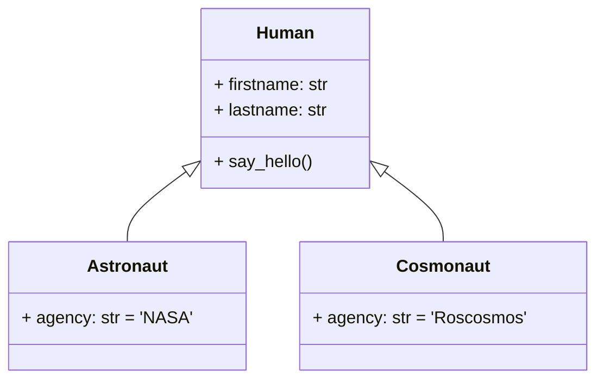

#

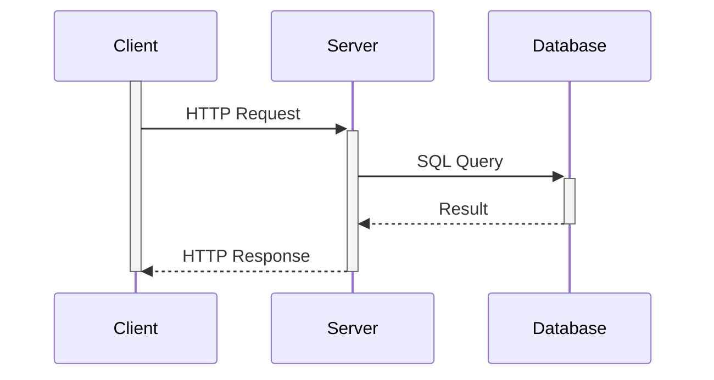

# CHARTS + CODING


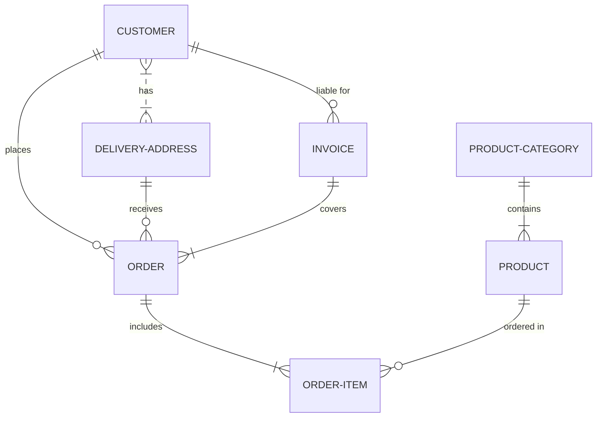
# 

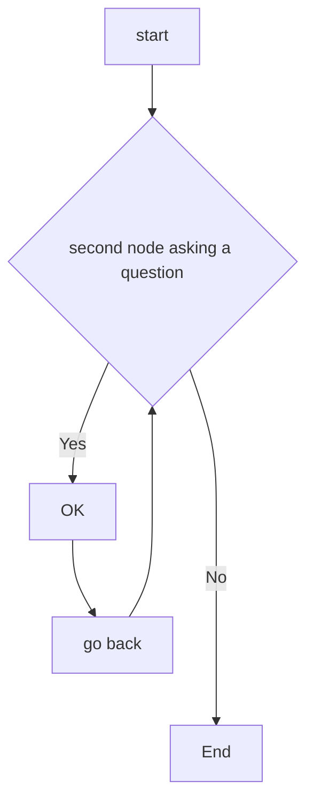
# 

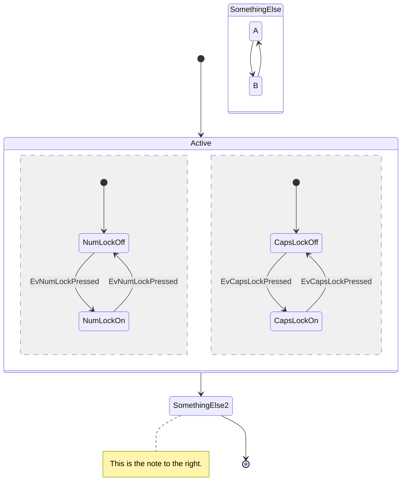

# 

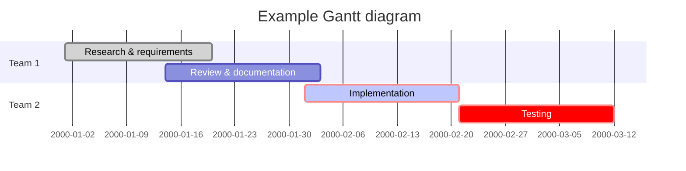

#

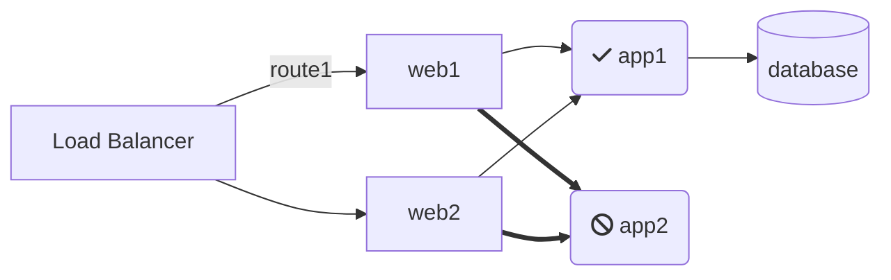

#

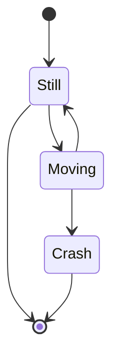

#


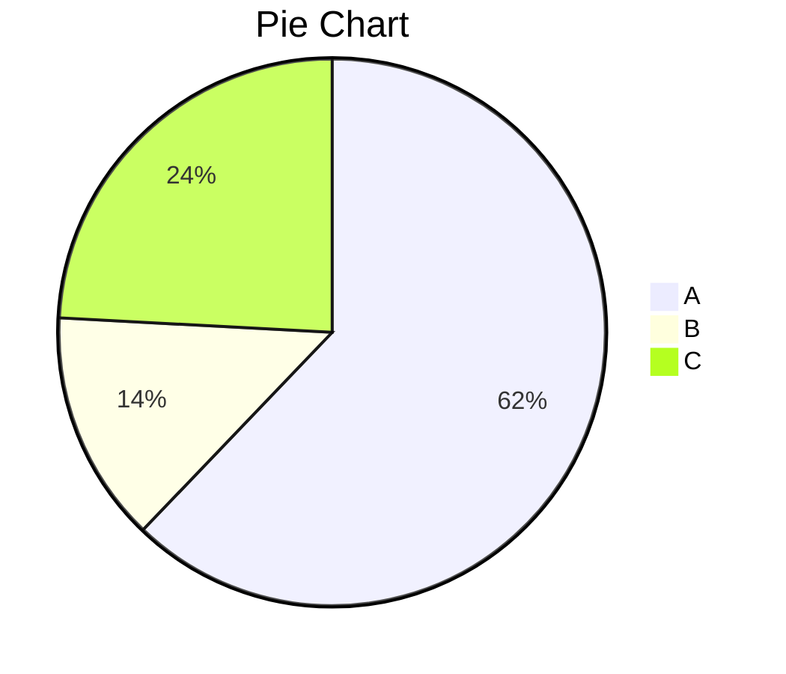

#

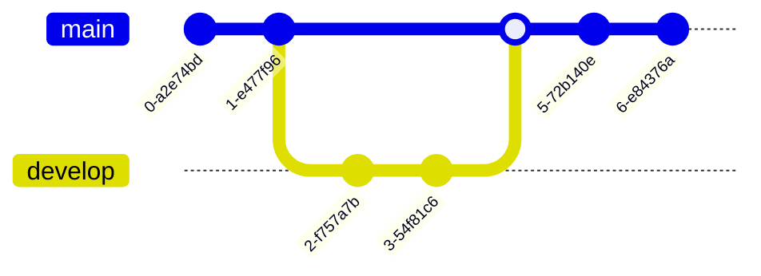

#

:root {
  --mermaid-theme: default; /*or base, dark, forest, neutral, night */
  --mermaid-font-family: "trebuchet ms", verdana, arial, sans-serif;
  --mermaid-sequence-numbers: off; /* or "on", see https://mermaid-js.github.io/mermaid/#/sequenceDiagram?id=sequencenumbers*/
  --mermaid-flowchart-curve: linear /* or "basis", see https://github.com/typora/typora-issues/issues/1632*/;
  --mermaid--gantt-left-padding: 75; /* see https://github.com/typora/typora-issues/issues/1665*/
}


:root {--mermaid-theme:dark;}	Screen Shot 2020-12-05 at 17.08.46
:root {--mermaid-theme:neutral;}	Screen Shot 2020-12-05 at 17.09.42
:root {--mermaid-theme:forest;}


#

```
function test() {
  console.log("notice the blank line before this function?");
}
```


